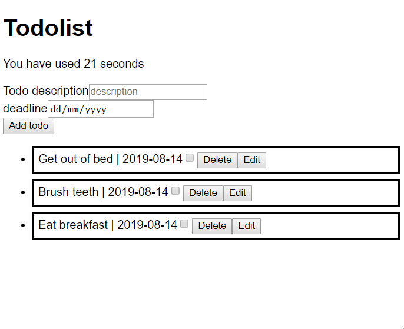

# TODO app
A simple ToDo App which load the default todo items by fetching the api found here: `https://gist.githubusercontent.com/benna100/391eee7a119b50bd2c5960ab51622532/raw` using `fetch`

An user can add a new todo, edit or remove an existing todo.

Demo of how the homework should look

